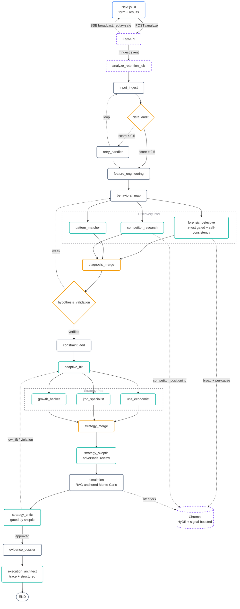
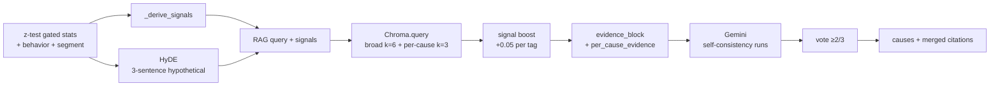
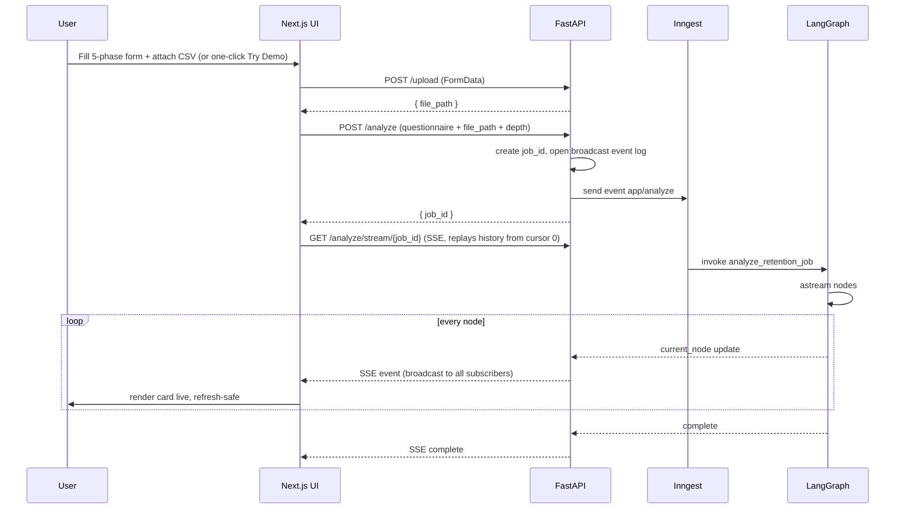

<div align="center">

# Retain AI

**Upload a customer CSV. Get a defensible, evidence-cited retention playbook — not a hallucinated one.**

CSV → Survival analysis → Statistically-gated diagnosis → Self-consistency voting → Adversarial review → RAG-anchored Monte Carlo → Streamed playbook.

**New here? Read [docs/pipeline-overview.md](./docs/pipeline-overview.md) — single doc tracing one CSV through every node.**

[Why it's different](#why-its-different) · [Overview](#overview) · [Architecture](#architecture) · [Graph](#the-graph) · [RAG](#rag-layer) · [UI Flow](#ui--data-flow) · [Stack](#tech-stack) · [Setup](#setup)

</div>

---

## Why it's different

Most "AI retention analysis" tools are a prompt wearing a spreadsheet costume: dump the CSV into an LLM, ask for a report, ship whatever comes back. Retain AI treats every LLM claim as **guilty until proven statistically significant**:

- **Every stat the LLM sees is z-test gated.** Every churn-rate bucket (plan tier, contract cadence, support volume, usage decile, tenure) carries a two-proportion z-test against the rest of the population. Prompts are instructed to *refuse* to build a root cause on a bucket that isn't significant. The model can't hallucinate a cause from noise — the math already told it which splits are real.
- **The forensic diagnosis votes with itself before you see it.** In deep mode, the root-cause prompt runs 3× in parallel at different temperatures; only causes that ≥2 of 3 independent runs agree on survive. Single-pass LLM hallucination doesn't make it to the playbook.
- **A second AI is paid to disagree with the first one.** A dedicated adversarial skeptic reviews every proposed strategy, scores its robustness, and can force a hard rejection — the critic gate treats a high-severity skeptic flag as an automatic constraint violation, no override.
- **Lift numbers are cited, not invented.** Monte Carlo simulation doesn't trust an LLM's "expect a 15% lift" — it retrieves real published case-study ranges from a retention-frameworks knowledge base and anchors the simulation's prior to that, only falling back to the model's self-reported estimate when nothing citable exists.
- **A survival model runs underneath the LLMs.** Kaplan-Meier curves and a CoxPH hazard model compute real statistics — median survival time, per-feature hazard ratios, high-risk-cohort sizing — before a single LLM call happens. The agents reason over these numbers; they don't guess at them.
- **Every problem in the final playbook has a receipt.** Each top problem carries a rationale chain: the triggering statistic → the cited root cause → the proposed tactic → its simulated outcome → the skeptic's risk flag → the mitigation. Click any hypothesis in the UI and the full evidence chain opens in a drawer.
- **You choose the depth.** A quick scan (~2–4 min) runs the fastest models end-to-end for a first pass. Deep analysis (~10–20 min) switches the reasoning-heavy nodes to a stronger model, triples the self-consistency voting, and runs a full two-pass synthesis. Same pipeline, dialed to the stakes.

The result: a 30-60-90 playbook where every number traces back to a statistic, a citation, or a simulation — not a paragraph the model felt confident about.

---

## Overview

Retain AI ingests a customer CSV plus a qualitative questionnaire and produces a ranked, evidence-cited retention playbook. The backend is a 21-node LangGraph that fans out to parallel LLM agents for discovery, runs an adversarial skeptic before strategy, and assembles a per-problem rationale chain for the final architect. The frontend is a Next.js 16 App Router app that streams each stage's output live over Server-Sent Events, with a broadcast event history so a mid-run refresh never loses your place.

Things the graph does that aren't visible in the final playbook:

- **Kaplan-Meier + CoxPH** on the raw tenure + churn columns (via `lifelines`) — powers the churn-probability slider and surfaces the top-5 hazard-ratio driver features into every downstream prompt. Categorical columns (plan tier, contract length) are one-hot encoded and ID-like columns are automatically excluded, so the hazard model reasons about real behavior instead of row noise.
- **Two-proportion z-test on every statistical bucket** — plan tier, contract cadence, support volume, usage decile, tenure bucket. Every number handed to an LLM carries a `p_value` and a `significant` flag; prompts are instructed to discount non-significant splits instead of building a narrative on noise.
- **Self-consistency on the forensic detective** — in deep mode, the candidate-cause prompt runs 3× in parallel at temps 0.2 / 0.5 / 0.7, then a vote keeps only causes appearing in ≥2 runs. Filters single-pass hallucinations.
- **HyDE-anchored RAG retrieval** — instead of querying Chroma with bare keywords, the forensic agent first writes a 3-sentence hypothetical answer for the priority segment, then embeds that, then retrieves. Plus a second per-cause retrieval pass for cause-specific evidence.
- **Strategy skeptic** — an adversarial LLM pass that scores robustness, flags weak tactics, suggests alternatives, and can hard-fail the critic gate if any tactic has a high-severity weakness.
- **RAG-anchored Monte Carlo** — simulation pulls expected-lift priors from retrieved framework chunks (e.g. "8–12% lift typical for activation nudges") instead of trusting LLM-claimed lifts.
- **Evidence dossier** — for each top-3 problem, a Python-assembled row pairs the triggering stat, root cause + citations, tactic, simulated outcome, skeptic risk, and mitigation. The architect prompt is required to map problem #N to dossier row #N.
- **Quick vs. deep analysis mode** — a single questionnaire toggle swaps the model tier (fast vs. reasoning-heavy), the self-consistency vote count (1 run vs. 3), and whether the architect runs its freeform reasoning-trace pass at all. Same graph, same guarantees, different time/depth trade-off.

---

## Architecture

<details>
<summary><b>Click to expand Architecture Diagram</b></summary>



</details>

Parallel fan-out is native LangGraph: `behavioral_map` emits edges to all three discovery nodes; `adaptive_hitl` emits edges to all three strategy nodes. Inside `forensic_detective`, self-consistency LLM calls also run concurrently via a thread-pool so they hit different round-robin API keys at once.

---

## The Graph

Entry: `input_ingest` · Exit: `execution_architect → END` · Compiled in [`backend/app/graph/builder.py`](./backend/app/graph/builder.py).

| #    | Node                                                           | Role                                                | Tool / Model                          |
| ---- | -------------------------------------------------------------- | ---------------------------------------------------- | ------------------------------------- |
| 1    | [input_ingest](./docs/nodes/input-ingest.md)                   | Load CSV, detect key columns (incl. plan vs. contract) | DuckDB                              |
| 2    | [data_audit](./docs/nodes/data-audit.md)                       | Quality score (nulls, dupes, size)                  | Pandas                                |
| —    | [retry_handler](./docs/nodes/retry-handler.md)                 | Loop back if score < 0.5                            | —                                     |
| 3    | [feature_engineering](./docs/nodes/feature-engineering.md)     | RFM, LTV, CoxPH risk + top-5 hazard drivers (categoricals one-hot encoded, IDs excluded) | lifelines CoxPHFitter |
| 4    | [behavioral_map](./docs/nodes/behavioral-map.md)               | KM survival curve + cohorts                         | lifelines KaplanMeierFitter           |
| 5a   | [forensic_detective](./docs/nodes/forensic-detective.md)       | Root causes — z-test gated stats + HyDE RAG + self-consistency vote | Gemini (fast/deep) + Chroma (parallel) |
| 5b   | [pattern_matcher](./docs/nodes/pattern-matcher.md)             | Segment + sequence discovery                        | Gemini (fast)                         |
| 5c   | [competitor_research](./docs/nodes/competitor-research.md)     | Counter-positioning evidence (if churn → known competitor) | Chroma only                    |
| 5d   | [diagnosis_merge](./docs/nodes/diagnosis-merge.md)             | Merge hypotheses, build significance-ranked top-segments table | pure Python                |
| 6    | [hypothesis_validation](./docs/nodes/hypothesis-validation.md) | Confidence × robustness gate                        | pure Python                           |
| 7    | [constraint_add](./docs/nodes/constraint-add.md)               | Feasibility filter over verified causes              | pure Python                           |
| 8    | [adaptive_hitl](./docs/nodes/adaptive-hitl.md)                 | Generate clarifying questions (idempotent on retry) | Gemini (fast)                         |
| 9a   | [unit_economist](./docs/nodes/unit-economist.md)               | ROI / LTV-CAC strategies (strict top + relaxed rest)| Groq (`openai/gpt-oss-120b`)          |
| 9b   | [jtbd_specialist](./docs/nodes/jtbd-specialist.md)             | Jobs-to-be-Done strategies                          | Groq (`openai/gpt-oss-120b`)          |
| 9c   | [growth_hacker](./docs/nodes/growth-hacker.md)                 | AARRR tactics + experiments                         | Groq (`openai/gpt-oss-120b`)          |
| 9d   | [strategy_merge](./docs/nodes/strategy-merge.md)               | Rank, forward operational fields                    | pure Python                           |
| 10a  | [strategy_skeptic](./docs/nodes/strategy-skeptic.md)           | Adversarial review of merged tactics                | Gemini (fast/deep)                    |
| 10b  | [simulation](./docs/nodes/simulation.md)                       | Monte Carlo lift (10k) with RAG-anchored priors     | NumPy + Chroma                        |
| 11   | [strategy_critic](./docs/nodes/strategy-critic.md)             | Senior-partner review — gated by skeptic severity   | Gemini (fast/deep)                    |
| 11.5 | [evidence_dossier](./docs/nodes/evidence-dossier.md)           | Per-problem rationale chain (stat → cause → tactic → sim → risk → mitigation) | pure Python |
| 12   | [execution_architect](./docs/nodes/execution-architect.md)     | Two-pass: reasoning trace → final 30-60-90 playbook | Gemini (fast/deep, trace + structured) |

**Quick vs. deep** (chosen per-run in the questionnaire): quick mode pins every Gemini call to the fast tier, runs forensic diagnosis single-pass, and skips the architect's freeform reasoning trace — full pipeline in ~2–4 minutes. Deep mode promotes the reasoning-heavy nodes (forensic, both skeptics, critic, architect) to a stronger model, triples the self-consistency vote, and runs the full two-pass synthesis — ~10–20 minutes for maximum depth.

Routing thresholds live in [`backend/app/graph/conditions.py`](./backend/app/graph/conditions.py). Retry loops are currently gated off on Render's free tier (`MAX_RETRIES=0`, `MAX_DISCOVERY_ATTEMPTS=0`, `MAX_CRITIC_ITERATIONS=0`) — each retry doubles state RSS, which busts the 512 MB cap. `build_critic_feedback_block()` in `app/graph/utils.py` already embeds the prior critic's verdict + weaknesses + recommendations into every retry agent's prompt, ready for when retries are re-enabled on a bigger instance.

---

## RAG Layer

Three callers retrieve from Chroma:

- **forensic_detective** — broad pass (k=6) using a HyDE-generated hypothetical answer + signal tags, then a per-cause pass (k=3 per top cause) using the cause text itself.
- **competitor_research** — if the churn-destination questionnaire answer signals a competitor loss, matches against ~40 known competitors (Slack/Teams, HubSpot/Salesforce, Notion/Confluence, Asana/Jira/Linear, …), retrieves k=4 chunks tagged `competitor_positioning`, and parses `Counter-play:` markers into actionable counter-positioning items.
- **simulation** — per strategy, retrieves k=2 chunks and regex-extracts lift ranges (`10-15%`, `8 pp`) to seed Monte Carlo μ. Falls back to the LLM's self-reported lift only if no citable prior is found in the corpus.

All retrievals get a `+0.05` cosine-score boost per matching signal tag (e.g. `30_day_cliff`, `low_integration`, `competitor_threat`). Corpus lives in [`backend/app/rag/corpus_data.py`](./backend/app/rag/corpus_data.py); re-ingest with `python -m app.rag.ingest` after edits.



---

## UI & Data Flow



SSE is a **broadcast**, not a single-consumer queue: every event is appended to an append-only per-job history, and every open connection replays from its own cursor. A page refresh mid-run — or two tabs open on the same job — never drops an event (including the human-in-the-loop question prompt, which is easy to lose with a naive queue). Stage timers are derived from the backend's event timestamps, not client arrival time, so durations stay correct across refreshes too.

SSE event payloads emitted by `backend/app/main.py`:

| Event                    | Carries                                                                                                  |
| ------------------------- | ---------------------------------------------------------------------------------------------------------- |
| `risk_ready`              | CoxPH risk + KM curve                                                                                       |
| `churn_profile_ready`     | Cohort breakdowns                                                                                            |
| `forensic_progress`       | Per-run self-consistency status (started / completed / failed at temp t)                                    |
| `diagnosis_ready`         | merged hypotheses, `top_segments` (with p-values), `driver_features`, `competitor_research_output`          |
| `hitl_questions_ready`    | Clarifying questions generated from the diagnosis, paused for human answers                                 |
| `critic_retry_started`    | Strategy critic rejected the pass — iteration count, verdict, weak points                                   |
| `simulation_ready`        | intervention impacts (with `lift_prior_anchor`, `lift_prior_citations`), `strategy_skeptic_output`, `rag_anchored_count` |
| `solution_ready`          | `final_playbook` (including `reasoning_trace` + per-problem `rationale_chain`), `evidence_dossier`           |
| `complete`                | Terminal sentinel                                                                                            |

Full detail in [docs/ui-flow.md](./docs/ui-flow.md).

---

## Tech Stack

| Layer     | Stack                                                                                  |
| --------- | -------------------------------------------------------------------------------------- |
| Frontend  | Next.js 16.2.4 (App Router), React 19, Tailwind v4 (fully utility-based, no hand-written CSS), shadcn/ui |
| Backend   | FastAPI, Inngest (background jobs), LangGraph, LangChain                               |
| LLMs      | Google Gemini (fast tier + deep tier, selected per `analysis_depth`), Groq `openai/gpt-oss-120b` (strategy + critic) |
| Data      | DuckDB (CSV parsing), Pandas, NumPy, SciPy (two-proportion z-tests), lifelines (KM + CoxPH) |
| RAG       | ChromaDB (PersistentClient, `all-MiniLM-L6-v2`, cosine + signal boost)                 |
| Transport | Server-Sent Events (SSE), broadcast + replay model — refresh-safe                      |

---

## Setup

<details>
<summary><b>Local dev</b> — click to expand</summary>

```bash
# Backend
cd backend
make install                      # creates venv + ingests RAG corpus
make dev                          # runs FastAPI + Inngest dev server together

# Frontend
cd frontend
npm install
npm run dev                       # http://localhost:3000
```

Required env (`backend/.env`):

```
GOOGLE_API_KEY_1=...
GOOGLE_API_KEY_2=...     # optional — add up to GOOGLE_API_KEY_32 for higher throughput
GROQ_API_KEY_1=...
GROQ_API_KEY_2=...
GROQ_API_KEY_3=...
INNGEST_DEV=1
```

Key discovery in `backend/app/config.py` scans `GOOGLE_API_KEY` plus `GOOGLE_API_KEY_1..32` (same for Groq). The failover wrapper round-robins across all live keys and marks a key temporarily dead on a 429 / quota error, reviving it automatically after a cooldown. More keys = more concurrent capacity; deep-mode's parallel self-consistency calls each grab a distinct key.

No data yet? Click **Try demo** on the landing page — it one-click-fills the full questionnaire and runs the pipeline against a bundled, pre-tuned 300-row sample dataset. Or bring your own: sample CSVs live in [`backend/dataForTesting/`](./backend/dataForTesting/). Re-run `python -m app.rag.ingest` after editing `backend/app/rag/corpus_data.py`.

</details>

---

<sub>Further reading: [Pipeline overview](./docs/pipeline-overview.md) · [State schema](./docs/state.md) · [Nodes](./docs/nodes/) · [Agents](./docs/agents/) · [RAG](./docs/rag.md) · [HyDE](./docs/rag/hyde.md) · [LLM factory](./docs/llm-factory.md) · [UI flow](./docs/ui-flow.md)</sub>
