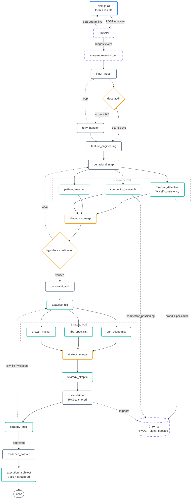
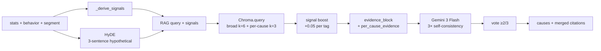
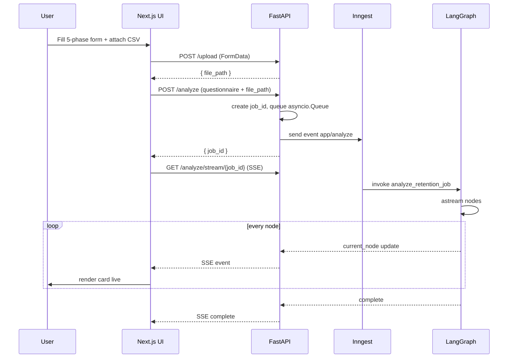

<div align="center">

# Retain AI

**A LangGraph pipeline that turns a customer CSV into a 30-60-90 retention playbook.**

CSV → Survival analysis → RAG-grounded diagnosis → Adversarial review → Simulated playbook — streamed live over SSE.

**New here? Read [docs/pipeline-overview.md](./docs/pipeline-overview.md) — single doc tracing one CSV through every node.**

[Overview](#overview) · [Architecture](#architecture) · [Graph](#the-graph) · [RAG](#rag-layer) · [UI Flow](#ui--data-flow) · [Stack](#tech-stack) · [Setup](#setup)

</div>

---

## Overview

Retain AI ingests a customer CSV plus a qualitative questionnaire and produces a ranked, evidence-cited retention playbook. The backend is a ~21-node LangGraph that fans out to parallel LLM agents for discovery, runs an adversarial skeptic before strategy, and assembles a per-problem rationale chain for the final architect — every claim is traceable back to a statistic, a citation, and a Monte Carlo lift estimate. The frontend is a Next.js 16 App Router app that streams each stage's output as it completes via Server-Sent Events.

Things the graph does that aren't visible in the final playbook:

- **Kaplan-Meier + CoxPH** on the raw tenure + churn columns (via `lifelines`) — powers the churn-probability slider and surfaces the top-5 hazard-ratio driver features into every downstream prompt.
- **Self-consistency on the forensic detective** — the candidate-cause prompt runs 3× in parallel at temps 0.2 / 0.5 / 0.7, then a vote keeps only causes appearing in ≥2 runs. Filters single-pass hallucinations.
- **HyDE-anchored RAG retrieval** — instead of querying Chroma with bare keywords, the forensic agent first writes a 3-sentence hypothetical answer for the priority segment, then embeds that, then retrieves. Plus a second per-cause retrieval pass for cause-specific evidence.
- **Strategy skeptic** — an adversarial Gemini pass that scores robustness, flags weak tactics, suggests alternatives, and can hard-fail the critic gate if any tactic has a high-severity weakness.
- **RAG-anchored Monte Carlo** — simulation pulls expected-lift priors from retrieved framework chunks (e.g. "8–12% lift typical for activation nudges") instead of trusting LLM-claimed lifts.
- **Evidence dossier** — for each top-3 problem, a Python-assembled row pairs the triggering stat, root cause + citations, tactic, simulated outcome, skeptic risk, and mitigation. The architect prompt is required to map problem #N to dossier row #N.

---

## Architecture

<details>
<summary><b>Click to expand Architecture Diagram</b></summary>



</details>

Parallel fan-out is native LangGraph: `behavioral_map` emits edges to all three discovery nodes; `adaptive_hitl` emits edges to all three strategy nodes. Inside `forensic_detective` the 3 self-consistency LLM calls also run concurrently via a thread-pool so they hit 3 different round-robin Gemini keys at once.

---

## The Graph

Entry: `input_ingest` · Exit: `execution_architect → END` · Compiled in [`backend/app/graph/builder.py`](./backend/app/graph/builder.py).

| #    | Node                                                           | Role                                                | Tool / Model                          |
| ---- | -------------------------------------------------------------- | --------------------------------------------------- | ------------------------------------- |
| 1    | [input_ingest](./docs/nodes/input-ingest.md)                   | Load CSV, detect key columns                        | DuckDB                                |
| 2    | [data_audit](./docs/nodes/data-audit.md)                       | Quality score (nulls, dupes, size)                  | Pandas                                |
| —    | [retry_handler](./docs/nodes/retry-handler.md)                 | Loop back if score < 0.5                            | —                                     |
| 3    | [feature_engineering](./docs/nodes/feature-engineering.md)     | RFM, LTV, CoxPH risk + top-5 hazard drivers         | lifelines CoxPHFitter                 |
| 4    | [behavioral_map](./docs/nodes/behavioral-map.md)               | KM survival curve + cohorts                         | lifelines KaplanMeierFitter           |
| 5a   | [forensic_detective](./docs/nodes/forensic-detective.md)       | Root causes — HyDE RAG + 3× self-consistency vote   | Gemini 3 Flash + Chroma (parallel)    |
| 5b   | [pattern_matcher](./docs/nodes/pattern-matcher.md)             | Segment + sequence discovery                        | Gemini 3 Flash                        |
| 5c   | [competitor_research](./docs/nodes/competitor-research.md)     | Counter-positioning evidence (if churn → known competitor) | Chroma only                    |
| 5d   | [diagnosis_merge](./docs/nodes/diagnosis-merge.md)             | Merge hypotheses, build top-segments table          | pure Python                           |
| 6    | [hypothesis_validation](./docs/nodes/hypothesis-validation.md) | Confidence × robustness gate                        | pure Python                           |
| 7    | [constraint_add](./docs/nodes/constraint-add.md)               | Budget / legal feasibility filter                   | pure Python                           |
| 8    | [adaptive_hitl](./docs/nodes/adaptive-hitl.md)                 | Generate clarifying questions (idempotent on retry) | Gemini 3 Flash                        |
| 9a   | [unit_economist](./docs/nodes/unit-economist.md)               | ROI / LTV-CAC strategies (strict top + relaxed rest)| Groq Llama 3.3 70B                    |
| 9b   | [jtbd_specialist](./docs/nodes/jtbd-specialist.md)             | Jobs-to-be-Done strategies                          | Groq Llama 3.3 70B                    |
| 9c   | [growth_hacker](./docs/nodes/growth-hacker.md)                 | AARRR tactics + experiments                         | Groq Llama 3.3 70B                    |
| 9d   | [strategy_merge](./docs/nodes/strategy-merge.md)               | Rank, forward operational fields                    | pure Python                           |
| 10a  | [strategy_skeptic](./docs/nodes/strategy-skeptic.md)           | Adversarial review of merged tactics                | Gemini 3 Flash                        |
| 10b  | [simulation](./docs/nodes/simulation.md)                       | Monte Carlo lift (10k) with RAG-anchored priors     | NumPy + Chroma                        |
| 11   | [strategy_critic](./docs/nodes/strategy-critic.md)             | Senior-partner review — gated by skeptic severity   | Groq Llama 3.3 70B                    |
| 11.5 | [evidence_dossier](./docs/nodes/evidence-dossier.md)           | Per-problem rationale chain (stat → cause → tactic → sim → risk → mitigation) | pure Python |
| 12   | [execution_architect](./docs/nodes/execution-architect.md)     | Two-pass: reasoning trace → final 30-60-90 playbook | Gemini 3 Flash (trace + structured)   |

Routing thresholds live in [`backend/app/graph/conditions.py`](./backend/app/graph/conditions.py). Currently all retry loops are gated off on Render's free tier: `MAX_RETRIES=0`, `MAX_DISCOVERY_ATTEMPTS=0`, `MAX_CRITIC_ITERATIONS=0`. Each retry doubles state RSS (the new pass's agent outputs stack on top of the prior pass's) which busts the 512 MB cap. On a bigger instance, raise these to 1 to enable single-retry passes — `build_critic_feedback_block()` in `app/graph/utils.py` already embeds the prior critic's verdict + weaknesses + recommendations into every retry agent's prompt.

---

## RAG Layer

Three callers retrieve from Chroma:

- **forensic_detective** — broad pass (k=6) using HyDE-generated hypothetical answer + signal tags, then a per-cause pass (k=3 per top cause) using the cause text itself.
- **competitor_research** — if `churn_destination` matches a known competitor (Slack/Teams, HubSpot/Salesforce, Notion/Confluence, Asana/Jira/Linear, …), retrieves k=4 chunks tagged `competitor_positioning` and parses `Counter-play:` markers into actionable counter-positioning items.
- **simulation** — per strategy, retrieves k=2 chunks and regex-extracts lift ranges (`10-15%`, `8 pp`) to seed Monte Carlo μ. Falls back to LLM-claimed lift if no parseable prior found.

All retrievals get a `+0.05` cosine-score boost per matching signal tag (e.g. `30_day_cliff`, `low_integration`, `competitor_threat`). Corpus lives in [`backend/app/rag/corpus_data.py`](./backend/app/rag/corpus_data.py); re-ingest with `python -m app.rag.ingest` after edits.



---

## UI & Data Flow



SSE event payloads emitted by `backend/app/main.py`:

| Event                  | Carries                                                                                                  |
| ---------------------- | -------------------------------------------------------------------------------------------------------- |
| `risk_ready`           | CoxPH risk + KM curve                                                                                    |
| `churn_profile_ready`  | Cohort breakdowns                                                                                        |
| `forensic_progress`    | Per-run self-consistency status (started / completed / failed at temp t)                                 |
| `diagnosis_ready`      | merged hypotheses, `top_segments`, `driver_features`, `competitor_research_output`                       |
| `simulation_ready`     | intervention impacts (with `lift_prior_anchor`, `lift_prior_citations`), `strategy_skeptic_output`, `rag_anchored_count` |
| `solution_ready`       | `final_playbook` (including `reasoning_trace` + per-problem `rationale_chain`), `evidence_dossier`       |
| `complete`             | Terminal sentinel                                                                                        |

Full detail in [docs/ui-flow.md](./docs/ui-flow.md).

---

## Tech Stack

| Layer     | Stack                                                                                  |
| --------- | -------------------------------------------------------------------------------------- |
| Frontend  | Next.js 16.2.4 (App Router), React 19, Tailwind v4, shadcn/ui, lucide-react            |
| Backend   | FastAPI, Inngest (background jobs), LangGraph, LangChain                               |
| LLMs      | Google Gemini 3 Flash Preview (discovery + architect), Groq Llama 3.3 70B (strategy + critic) |
| Data      | DuckDB (CSV parsing), Pandas, NumPy, lifelines (KM + CoxPH)                            |
| RAG       | ChromaDB (PersistentClient, `all-MiniLM-L6-v2`, cosine + signal boost)                 |
| Transport | Server-Sent Events (SSE) for live results streaming                                    |

---

## Setup

<details>
<summary><b>Local dev</b> — click to expand</summary>

```bash
# Backend
cd backend
make install                      # creates venv + ingests RAG corpus
make dev                          # runs FastAPI + Inngest dev server together

# Frontend
cd frontend
npm install
npm run dev                       # http://localhost:3000
```

Required env (`backend/.env`):

```
GOOGLE_API_KEY_1=...
GOOGLE_API_KEY_2=...     # optional — add up to GOOGLE_API_KEY_32 for higher throughput
GROQ_API_KEY_1=...
GROQ_API_KEY_2=...
GROQ_API_KEY_3=...
INNGEST_DEV=1
```

Key discovery in `backend/app/config.py` scans `GOOGLE_API_KEY` plus `GOOGLE_API_KEY_1..32` (same for Groq). Failover wrapper round-robins across all live keys and marks a key dead temporarily on a 429 / quota error. More keys = more concurrent capacity; the 3 self-consistency forensic calls each grab a distinct key.

Sample CSVs live in [`backend/dataForTesting/`](./backend/dataForTesting/). Re-run `python -m app.rag.ingest` after editing `backend/app/rag/corpus_data.py`.

</details>

---

<sub>Further reading: [Pipeline overview](./docs/pipeline-overview.md) · [State schema](./docs/state.md) · [Nodes](./docs/nodes/) · [Agents](./docs/agents/) · [RAG](./docs/rag.md) · [HyDE](./docs/rag/hyde.md) · [LLM factory](./docs/llm-factory.md) · [UI flow](./docs/ui-flow.md)</sub>
