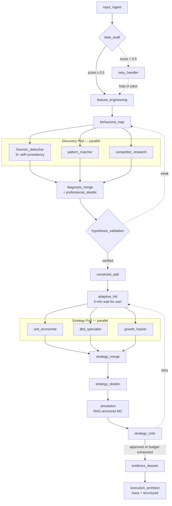

# Pipeline Overview — End-to-end Walkthrough

This is the read-first doc. It traces a single CSV from the user clicking **Submit** in the form to the final 30-60-90 playbook arriving in the browser, naming every component along the way.

If you only read one doc, read this one.

---

## TL;DR

```
User CSV + form
      │
      ▼
POST /upload      (FastAPI saves CSV to /tmp)
POST /analyze     (FastAPI enqueues Inngest job)
      │
      ▼
Inngest dispatches → LangGraph pipeline (21 nodes, mostly parallel pods)
      │
      │  pushes SSE events into asyncio.Queue keyed by job_id
      ▼
GET /analyze/stream/{job_id}   ← frontend EventSource subscribes
      │
      ▼
React renders each card as the matching SSE event arrives.
```

The whole thing typically takes ~2–3 minutes wall-time on Render's free tier, dominated by the forensic agent's 3-way self-consistency vote and the strategy critic's optional retry pass.

---

## Layer map

| Layer | Where | What it does |
|---|---|---|
| Frontend | `frontend/app/form/page.tsx`, `frontend/app/results/[job_id]/page.tsx` | Collect questionnaire + CSV, then stream-render results. |
| HTTP API | `backend/app/main.py` | `/upload`, `/analyze`, `/analyze/stream/{job_id}`, `/analyze/{job_id}/cancel`, `/analyze/{job_id}/respond`. |
| Background runner | Inngest (`@inngest_client.create_function`) | Receives `app/analyze` event and invokes the LangGraph stream. |
| Graph orchestration | `backend/app/graph/builder.py` | Wires every node + conditional edge with parallel fan-out/fan-in. |
| Shared state | `backend/app/graph/state.py` | `RetentionGraphState` — TypedDict every node reads and writes. |
| Nodes | `backend/app/graph/nodes/*.py` | One file per node. Some are thin wrappers around an agent. |
| Agents | `backend/app/graph/agents/{discovery,execution}/*.py` | LLM-driven reasoning units called by node wrappers. |
| LLM factory | `backend/app/config.py` | Round-robin key pool + failover for Gemini and Groq. |
| RAG | `backend/app/rag/{corpus_data,ingest,store,hyde}.py` | Chroma-backed retrieval with HyDE + signal-boosted scoring. |
| SSE infra | `backend/app/shared.py` + `backend/app/graph/stream_utils.py` | `active_streams` dict; `push_progress()` for mid-node updates. |

---

## Phase-by-phase walkthrough

### 1. Form submission

User fills the 5-phase questionnaire in `frontend/app/form/page.tsx` and selects a CSV. On submit the page first calls `POST /upload` (the file goes to `/tmp/retain_ai_uploads/<uuid>.csv`), gets back `{file_path}`, then calls `POST /analyze` with `{raw_csv_path, questionnaire}`.

```python
# backend/app/main.py
@app.post("/analyze")
async def run_analysis(req_body):
    job_id = str(uuid.uuid4())
    active_streams[job_id] = {"queue": asyncio.Queue(), "hitl_event": asyncio.Event(), ...}
    await inngest_client.send(inngest.Event(name="app/analyze", data=req_body))
    return {"status": "queued", "job_id": job_id}
```

The browser receives `{job_id}`, navigates to `/results/{job_id}`, and opens an SSE connection to `GET /analyze/stream/{job_id}`. That connection drains `active_streams[job_id]["queue"]` until a `complete` / `cancelled` / `error` event.

### 2. Inngest fires the LangGraph runner

`analyze_retention_job` (in `main.py`) runs inside an Inngest step. It builds the initial state and starts streaming the compiled graph:

```python
async for state in graph.astream(initial_state, config={"configurable": {"job_id": job_id}}, stream_mode="values"):
    node = state.get("current_node")
    if node == "feature_engineering": await queue.put({"type": "risk_ready", ...})
    elif node == "behavioral_map":    await queue.put({"type": "churn_profile_ready", ...})
    elif node == "diagnosis_merge":   await queue.put({"type": "diagnosis_ready", ...})
    elif node == "simulation":        await queue.put({"type": "simulation_ready", ...})
    elif node == "execution_architect": await queue.put({"type": "solution_ready", ...})
```

Five stages emit user-visible SSE events. Every node still runs — the SSE step just decides which transitions are worth showing.

### 3. The graph



Wiring lives in `backend/app/graph/builder.py`. Every node is wrapped with `_wrap_node()` which:
1. Checks for cancellation (`active_streams[job_id]["cancelled"]`) and raises `JobCancelled` if set.
2. Logs `[NODE→]` entry and `[NODE✓]` exit with elapsed seconds and current RSS.
3. Re-raises any exception while logging `[NODE✗]`.

### 4. What each phase does

| Phase | Nodes | Purpose | Doc |
|---|---|---|---|
| Ingest | `input_ingest` → `data_audit` → (optional `retry_handler`) | Load CSV with DuckDB, detect columns, score quality. | [nodes/input-ingest.md](./nodes/input-ingest.md), [nodes/data-audit.md](./nodes/data-audit.md), [nodes/retry-handler.md](./nodes/retry-handler.md) |
| Feature | `feature_engineering` | RFM / LTV / velocity + CoxPH survival regression. Surfaces top-5 hazard-ratio drivers. | [nodes/feature-engineering.md](./nodes/feature-engineering.md) |
| Behavior | `behavioral_map` | Kaplan-Meier survival curve, milestone retention, tenure cohorts. | [nodes/behavioral-map.md](./nodes/behavioral-map.md) |
| Discovery | `forensic_detective`, `pattern_matcher`, `competitor_research` (parallel) → `diagnosis_merge` | Diagnose root causes (forensic), find segments/sequences (pattern), pull competitor counter-positioning (when applicable), then run the professional skeptic + build the top-segments table. | [nodes/forensic-detective.md](./nodes/forensic-detective.md), [nodes/pattern-matcher.md](./nodes/pattern-matcher.md), [nodes/competitor-research.md](./nodes/competitor-research.md), [nodes/diagnosis-merge.md](./nodes/diagnosis-merge.md) |
| Validation | `hypothesis_validation` → `constraint_add` → `adaptive_hitl` | Gate on confidence × robustness, filter by budget/legal, then ask the human 2–3 clarifying questions over SSE. | [nodes/hypothesis-validation.md](./nodes/hypothesis-validation.md), [nodes/constraint-add.md](./nodes/constraint-add.md), [nodes/adaptive-hitl.md](./nodes/adaptive-hitl.md) |
| Strategy | `unit_economist`, `jtbd_specialist`, `growth_hacker` (parallel) → `strategy_merge` | Three Groq Llama agents propose interventions/tactics under different frameworks. Merge keeps the strict top + lighter alternatives. | [nodes/unit-economist.md](./nodes/unit-economist.md), [nodes/jtbd-specialist.md](./nodes/jtbd-specialist.md), [nodes/growth-hacker.md](./nodes/growth-hacker.md), [nodes/strategy-merge.md](./nodes/strategy-merge.md) |
| Review | `strategy_skeptic` → `simulation` → `strategy_critic` | Adversarial pre-sim review; RAG-anchored Monte Carlo (10k iters); senior-partner critic that gates approval. | [nodes/strategy-skeptic.md](./nodes/strategy-skeptic.md), [nodes/simulation.md](./nodes/simulation.md), [nodes/strategy-critic.md](./nodes/strategy-critic.md) |
| Finalize | `evidence_dossier` → `execution_architect` | Build per-problem rationale chains; pass-1 reasoning trace + pass-2 structured Pydantic playbook. | [nodes/evidence-dossier.md](./nodes/evidence-dossier.md), [nodes/execution-architect.md](./nodes/execution-architect.md) |

### 5. State as it grows

The single `RetentionGraphState` dict accretes keys node-by-node:

```
raw_csv_path, questionnaire, job_id                            ← initial
+ input_context, input_constraints                             ← input_ingest
+ data_quality_score, data_quality_logs                        ← data_audit
+ feature_store (with predictive_churn_risk.driver_features)   ← feature_engineering
+ behavior_curves, behavior_cohorts                            ← behavioral_map
+ forensic_detective_output                                    ← forensic_detective
+ pattern_matcher_output                                       ← pattern_matcher
+ competitor_research_output                                   ← competitor_research
+ professional_skeptic_output, diagnosis_results, top_segments ← diagnosis_merge
+ hypothesis_status, verified_root_causes                      ← hypothesis_validation
+ constrained_brief                                            ← constraint_add
+ hitl_questions, human_clarification                          ← adaptive_hitl
+ unit_economist_output, jtbd_specialist_output, growth_hacker_output ← strategy pod
+ strategy_outputs (with merged_strategies)                    ← strategy_merge
+ strategy_skeptic_output                                      ← strategy_skeptic
+ simulations, lift_percent                                    ← simulation
+ critic_verdict, criticism, feedback, iteration_count         ← strategy_critic
+ evidence_dossier                                             ← evidence_dossier
+ final_playbook, playbook_status                              ← execution_architect
```

Full schema and reducers: [state.md](./state.md).

### 6. The SSE events the user actually sees

Only five transitions write to the queue (`backend/app/main.py`):

| SSE `type` | Fired after node | Carries |
|---|---|---|
| `risk_ready` | `feature_engineering` | High-risk count, CoxPH concordance, RFM, engagement cohorts, data quality summary, input context. |
| `churn_profile_ready` | `behavioral_map` | KM survival curve (downsampled to ≤20 points), median survival, milestone retention, tenure cohorts. |
| `forensic_progress` (mid-node) | `forensic_detective` self-consistency runs | Per-run `started` / `completed` / `failed` at temps 0.2/0.5/0.7. |
| `hitl_questions_ready` (mid-node) | `adaptive_hitl` | 2–3 questions; UI shows a modal and posts answers to `/analyze/{job_id}/respond`. |
| `diagnosis_ready` | `diagnosis_merge` | `merged_hypotheses`, `forensic_findings`, `pattern_findings`, `skeptic_findings`, `competitor_research`, `top_segments`, `driver_features`. |
| `critic_retry_started` (mid-node) | `strategy_critic` (only when retrying) | `iteration`, `max`, verdict reason, skeptic flag count. |
| `simulation_ready` | `simulation` | `expected_lift`, `confidence_interval_5_95`, `interventions[]` (each with `lift_prior_anchor`/`pct`/`citations`), `rag_anchored_count`, `strategy_skeptic`. |
| `solution_ready` | `execution_architect` | `final_playbook` (with `reasoning_trace` and per-problem `rationale_chain`) + `evidence_dossier`. |
| `cancelled` / `error` | terminal failure paths | `error_type`, `error_message`, `last_node`. |
| `complete` | end of stream | `{}`; SSE handler then closes and pops `active_streams[job_id]`. |

Heartbeat: if the queue is silent for 15s the handler yields `: heartbeat\n\n` to keep proxies from killing the connection.

### 7. HITL pause

`adaptive_hitl` is unique — it is the only node that suspends the graph. It pushes `hitl_questions_ready` and then `await asyncio.wait_for(stream["hitl_event"].wait(), timeout=300)`. The frontend submits answers via `POST /analyze/{job_id}/respond`, which sets `stream["hitl_event"]` and unblocks the graph. After 5 minutes the timeout fires and the graph continues with empty answers.

On critic-retry the HITL node short-circuits: it reuses the prior answers from state instead of re-prompting (`if state.get("iteration_count", 0) >= 1: return prior`).

### 8. The critic loop (currently disabled on free-tier)

`conditions.py` sets `MAX_DISCOVERY_ATTEMPTS = 0` and `MAX_CRITIC_ITERATIONS = 0` — both retry loops are gated off because each retry doubles RSS on Render's 512 MB free tier (the graph keeps both passes' agent outputs in state). On a bigger instance you can raise these to enable 1 retry pass; `build_critic_feedback_block()` in `app/graph/utils.py` already embeds the prior critic verdict + weaknesses + recommendations into every retry agent's prompt.

### 9. Cancellation

`POST /analyze/{job_id}/cancel` sets `active_streams[job_id]["cancelled"] = True` and `hitl_event.set()` (so any waiting HITL unblocks immediately). On the next node entry, `_wrap_node` calls `is_cancelled(job_id)` and raises `JobCancelled`. The Inngest task catches it, pushes a `cancelled` SSE event, then a `complete`, and the SSE handler closes.

### 10. Why each external service exists

- **DuckDB** — reads any CSV without writing schema. Used in `input_ingest`, `data_audit`, `feature_engineering`, `behavioral_map`.
- **lifelines** — Kaplan-Meier + CoxPH. `feature_engineering` fits the CoxPH model and extracts top-5 hazard drivers; `behavioral_map` fits KM for the survival curve.
- **Chroma** — vector DB for the retention-framework corpus. Default embedder `all-MiniLM-L6-v2`. Persistent on disk at `backend/app/rag/chroma_db/`.
- **Gemini 3 Flash Preview** — discovery + architect. `forensic_detective`, `pattern_matcher`, `professional_skeptic`, `strategy_skeptic`, `adaptive_hitl`, `strategy_critic`, `execution_architect`, HyDE. Round-robins across `GOOGLE_API_KEY[_1..32]`.
- **Groq Llama 3.3 70B** — strategy agents. `unit_economist`, `jtbd_specialist`, `growth_hacker`. Round-robins across `GROQ_API_KEY[_1..32]`.
- **Inngest** — durable background job runner. Decouples the slow LangGraph stream from the API request that started it.
- **Render** — production host. Free tier is constrained on RSS, which is why the retry loops are disabled and why `app/main.py` symlinks `~/.cache/chroma` to the project dir so the ONNX cache survives cold starts.

---

## Where to go next

- **Want to add a node?** Read [state.md](./state.md) first (so you know what to write into state), then [nodes/](./nodes/) for the existing patterns. Register the node in `backend/app/graph/nodes/__init__.py` and wire it in `builder.py`.
- **Want to add a RAG signal tag?** [rag.md](./rag.md) and [rag/hyde.md](./rag/hyde.md). Add the tag to relevant chunks in `corpus_data.py`, teach `_derive_signals()` in `forensic_detective.py` to emit it, re-run `python -m app.rag.ingest`.
- **Want to swap a model?** Read [llm-factory.md](./llm-factory.md). All LLMs are obtained via `get_llm(provider, model, temperature)` — never instantiated directly.
- **Want to add an SSE event?** Update both the producer (`app/main.py` for stage transitions or `stream_utils.push_progress()` for mid-node) and the consumer (`frontend/app/results/[job_id]/page.tsx`). [ui-flow.md](./ui-flow.md) has the full event table.
