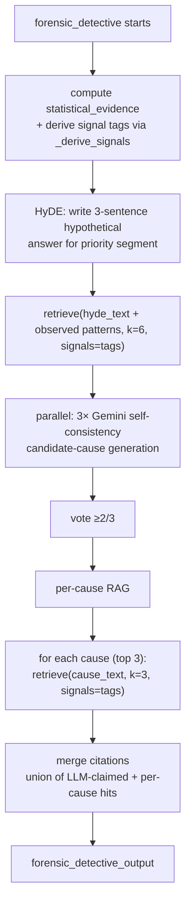

# RAG Layer

Chroma-backed retention-framework retrieval used by three callers:
- `forensic_detective` — broad HyDE-anchored pass + per-cause focused pass.
- `competitor_research` — competitor-positioning pass (only when `churn_destination` matches a known competitor).
- `simulation` — lift-prior pass (extract `10–15%` lift numbers from retrieved text to seed Monte Carlo μ).

Strategy agents do **not** retrieve from RAG directly — they receive the merged citations + the `top_segments` table from upstream.

## Files

| File | Role |
|---|---|
| [`backend/app/rag/corpus_data.py`](../backend/app/rag/corpus_data.py) | The corpus — a Python list of `{id, text, metadata}` chunks. |
| [`backend/app/rag/store.py`](../backend/app/rag/store.py) | Chroma client, collection, `retrieve()` with signal boost. |
| [`backend/app/rag/ingest.py`](../backend/app/rag/ingest.py) | `python -m app.rag.ingest` — wipes and reloads the collection. |
| [`backend/app/rag/hyde.py`](../backend/app/rag/hyde.py) | HyDE wrapper — see [rag/hyde.md](./rag/hyde.md). |

## Corpus

66 curated chunks covering: activation / aha moment, PMF, pricing, engagement decay, integration / network effects, customer success, segmentation, long-tenure, drop-off patterns, win-back, B2B-specific motions, diagnosis methodology, playbooks, benchmarks, PLG, education, and (added in F14) competitor positioning vs Slack/Teams, HubSpot/Salesforce, Intercom/Zendesk, Notion/Confluence, Asana/Jira/Linear, Mailchimp/Klaviyo, Zoom/Meet, Figma defense, Stripe/Square, and generic incumbents.

Each chunk:

```python
{
    "id": "reforge_aha_001",
    "text": "The Aha Moment is the point where ...",
    "metadata": {
        "source": "Reforge - Activation Framework",
        "topic": "activation",
        "signals": "short_tenure_churn,low_usage,new_user_drop_off",
        "industry": "saas",
    },
}
```

`signals` is a comma-separated list of semantic tags that describe which observed data patterns the chunk is most relevant to. Competitor-positioning chunks include `Counter-play:` markers in the text that `competitor_research` parses into discrete counter-positioning items.

## Vector store

```python
chromadb.PersistentClient(path="app/rag/chroma_db")
collection = client.get_or_create_collection(
    name="retention_knowledge",
    metadata={"hnsw:space": "cosine"},
)
```

- **Embedder:** Chroma's default `all-MiniLM-L6-v2`. 80 MB ONNX bundle downloaded on first use; on Render, `app/main.py` symlinks `~/.cache/chroma` to the project's `backend/app/rag/onnx_cache/` so the cache survives cold starts.
- **Persistence:** on-disk at `backend/app/rag/chroma_db/`.
- **Telemetry:** `anonymized_telemetry=False`.

## Retrieval API

```python
from app.rag.store import retrieve as rag_retrieve

hits = rag_retrieve(
    query="why does the Newest customers segment churn in a B2B SaaS company? ...",
    k=6,
    signals=["short_tenure_churn", "30_day_cliff"],
)
# → [{id, text, source, topic, score}, ...]
```

Implementation:

```python
def retrieve(query: str, k: int = 5, signals: list[str] | None = None) -> list[dict]:
    col = get_collection()
    if col.count() == 0:
        return []
    results = col.query(query_texts=[query], n_results=k)
    # ...
    for i, doc in enumerate(docs):
        chunk_signals = (metas[i].get("signals") or "").split(",")
        signal_boost = 0.0
        if signals:
            overlap = len(set(s.strip() for s in chunk_signals) & set(signals))
            signal_boost = overlap * 0.05
        base_score = 1.0 - (dists[i] / 2.0)        # cosine distance → similarity
        chunks.append({"id": ids[i], "text": doc, ..., "score": base_score + signal_boost})
    chunks.sort(key=lambda c: c["score"], reverse=True)
    return chunks
```

### Scoring

```
base_score    = 1.0 - (cosine_distance / 2.0)         # → similarity in [0, 1]
signal_boost  = 0.05 × |chunk.signals ∩ query.signals|
final_score   = base_score + signal_boost
```

Chunks are re-sorted by `final_score` (descending). A chunk that's topically close **and** matches multiple signal tags reliably beats a purely-semantic match — that's how the forensic agent gets framework-tagged chunks for "30-day cliff" patterns even when the literal phrase isn't in the chunk.

## Forensic retrieval flow



Two passes:

1. **Broad pass (k=6, HyDE-anchored).** The query is the concatenation of:
   - HyDE 3-sentence hypothetical answer for the priority segment (`hypothetical_segment_answer` in `app/rag/hyde.py`).
   - Observed patterns: `"Churn rate {x}\nMedian survival {y}"`.

   Signal tags are derived from `statistical_evidence` (`_derive_signals` in `forensic_detective.py`). This pass produces the `evidence_block` that goes into the candidate-cause prompt.

2. **Per-cause pass (k=3 per cause, signal tags reused).** For each of the top-3 voted causes, retrieve k=3 chunks using the cause text itself as the query. Result populates `forensic_detective_output.per_cause_evidence`. The final `forensic_detective_output.citations` is the union of LLM self-cited ids + per-cause retrieval ids.

## Competitor retrieval flow

`competitor_research` runs in parallel with forensic + pattern. If `questionnaire.churn_destination` substring-matches the `KNOWN_COMPETITORS` table in `app/graph/nodes/competitor_research.py`, it calls:

```python
hits = rag_retrieve(
    query=f"Counter-positioning, retention, and switching-cost defense when customers churn to {competitor}. Industry: {industry}.",
    k=4,
    signals=["competitor_threat", "switching_to_incumbent", "bundling_loss"],
)
```

Then filters to `topic == "competitor_positioning"` (falls back to all hits if none match), keeps top 3 as `evidence`, and parses `Counter-play:` / `Counter-positioning:` markers out of the text into a discrete `counter_positioning` list.

If `churn_destination` doesn't match, the node returns `{matched: False, evidence: [], counter_positioning: []}` and adds zero downstream cost.

## Simulation retrieval flow

For each of the top-3 merged strategies, `simulation_node` (in `app/graph/nodes/simulation.py`) calls:

```python
query = f"typical retention lift from {tactic_name}. Metric: {target_metric or 'retention'}. Cite percentage-point lift ranges from real case studies."
hits = rag_retrieve(query, k=2)
```

…then regex-extracts ranges like `10-15%`, `10–15 pp`, `10 to 15 percentage points` and single values like `8%` from `hit.text`. Values are clamped to `[0.1, 30]` pp (plausibility ceiling). If parsing succeeds, the Monte Carlo's μ becomes `mean(values)` and the intervention's `lift_prior_anchor = "rag"`; otherwise it falls back to the strategy's self-reported `expected_lift_pct_p50` and anchor is `"self_reported"`. Citations of parsed chunks surface in `intervention_impacts[i].lift_prior_citations`.

The summary key `simulations.simulation_summary.rag_anchored_count` tells you how many of the 3 modeled strategies got a RAG-anchored prior.

## Prompt injection (forensic)

```python
evidence_block = "\n\n".join(
    f"[{i+1}] Source: {c['source']} (id: {c['id']})\n{c['text']}"
    for i, c in enumerate(broad_retrieved)
)
```

The prompt requires:

```
- Each suspected cause must be grounded in one or more retrieved frameworks.
- Reference frameworks by source id in citations map (e.g., {"cause text": ["reforge_aha_001"]}).
```

Result: `forensic_detective_output.citations = {cause: [chunk_id, ...]}` — the F15 evidence drawer in the frontend renders these as chips.

## Extending

| Change | Steps |
|---|---|
| Add a new chunk | Append to `CORPUS` with a unique `id`, set `signals` to whatever data patterns it answers to. Re-run `python -m app.rag.ingest`. |
| Add a new signal tag | (1) Add it to `metadata.signals` on relevant chunks. (2) Teach `_derive_signals()` in `forensic_detective.py` to emit it when the matching stat pattern appears (e.g. plan-tier disparity → `plan_tier_churn`). Re-ingest. |
| Add a new known competitor | Extend `KNOWN_COMPETITORS` in `app/graph/nodes/competitor_research.py`. Add corresponding `topic: competitor_positioning` chunks to `corpus_data.py` with a `Counter-play:` marker. Re-ingest. |
| Swap embedder | Pass `embedding_function` to `get_or_create_collection()`. Will require re-ingest. |
| Use RAG from a strategy agent | Import `from app.rag.store import retrieve as rag_retrieve`. The query → retrieve → evidence_block → cited JSON pattern is portable. |

## Operations

```bash
cd backend
python -m app.rag.ingest      # drops + recreates the collection
```

Verify count:

```python
from app.rag.store import get_collection
get_collection().count()       # should equal len(CORPUS)
```

If `count() == 0`, `retrieve()` returns `[]` and the forensic agent falls back to `"(no retrieved frameworks — reason from stats alone)"`. The pipeline still completes but citations will be missing.
