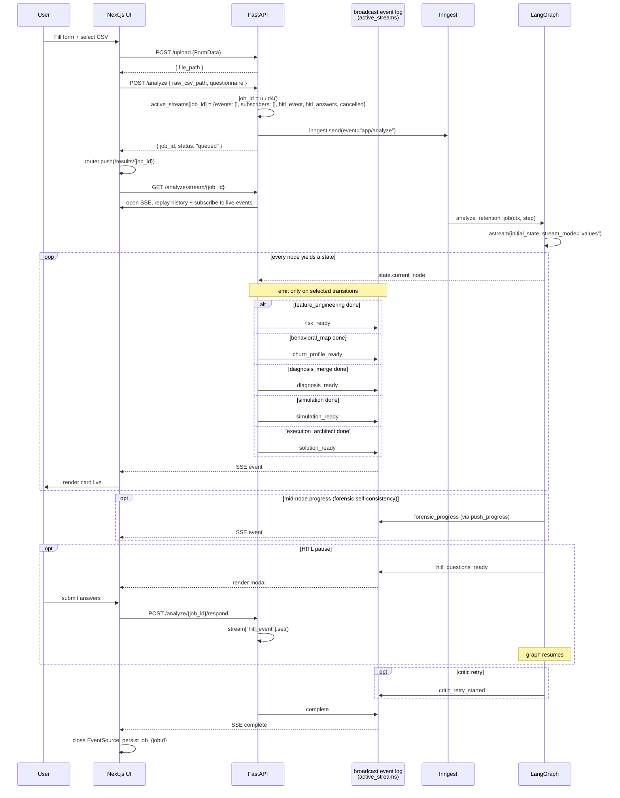

# UI & Data Flow

End-to-end trace from the user clicking **Submit** on the form to the playbook rendering. Read [pipeline-overview.md](./pipeline-overview.md) first if you haven't.

## Files

| Role | File |
|---|---|
| Landing | [`frontend/app/page.tsx`](../frontend/app/page.tsx) |
| Form (5 phases + depth toggle) | [`frontend/app/form/page.tsx`](../frontend/app/form/page.tsx) |
| Results orchestrator | [`frontend/app/results/[job_id]/page.tsx`](../frontend/app/results/[job_id]/page.tsx) |
| SSE hook + snapshot persistence | [`frontend/app/results/[job_id]/useAnalysisStream.ts`](../frontend/app/results/[job_id]/useAnalysisStream.ts) |
| Results sections | [`frontend/app/results/[job_id]/components/`](../frontend/app/results/[job_id]/components/) — one file per section, Tailwind utilities only (no hand-written CSS) |
| API entry | [`backend/app/main.py`](../backend/app/main.py) |
| SSE infra | [`backend/app/shared.py`](../backend/app/shared.py), [`backend/app/graph/stream_utils.py`](../backend/app/graph/stream_utils.py) |

## HTTP API

| Method | Path | Purpose | Body / Returns |
|---|---|---|---|
| `POST` | `/upload` | Store uploaded CSV in `/tmp/retain_ai_uploads/<uuid>.csv`. | FormData `file`. Returns `{status, file_path, original_name}`. |
| `POST` | `/analyze` | Queue a new analysis. Creates `active_streams[job_id]` and sends an Inngest event. | `{raw_csv_path, questionnaire}`. Returns `{status: "queued", job_id, message}`. |
| `GET`  | `/analyze/stream/{job_id}` | Server-Sent Events stream. Replays `active_streams[job_id]["events"]` from its own cursor, then follows live, until a `complete` event. Multiple connections on the same job each get the full history — nothing is consumed. | `text/event-stream`. |
| `POST` | `/analyze/{job_id}/cancel` | Mark the job cancelled. Next node entry raises `JobCancelled`. Also `set()`s the HITL event so a paused graph unblocks. | `{}`. Returns `{status, job_id, cancelled}`. |
| `POST` | `/analyze/{job_id}/respond` | Submit HITL answers. Sets `stream["hitl_event"]` so `adaptive_hitl` resumes. | `{answers: {...}}`. Returns `{status: "ok"}`. |
| `GET`  | `/` | Health string. |  |
| `GET`  | `/healthz` | Liveness probe. | `{ok: true}`. |

## Request payload shape

The frontend uploads the CSV first, then sends the analysis request:

```json
POST /analyze
{
  "raw_csv_path": "a1b2c3d4...csv",     // returned by /upload — basename, not full path
  "questionnaire": {
    "business_context": "Retention analytics for SaaS",
    "industry": "SaaS",
    "size": "100-500",
    "business_model": "B2B SaaS",
    "company_stage": "Series A",
    "goal": "Reduce churn rate",
    "timeline": "Quick wins (30 days)",
    "priority_segment": "Newest customers (first 90 days)",
    "typical_customer": "...",
    "can_ship_changes": "No",
    "support_model": "Self-serve only",
    "pricing_flexibility": ["None — pricing is locked"],
    "retention_tactics": ["onboarding email"],
    "competitors": ["Slack"],
    "churn_destination": "Microsoft Teams",
    "time_range": "last_12_months",
    "legal_constraints": ["GDPR"],
    "budget": "medium",
    "analysis_depth": "quick",
    "edge_cases": ["Monthly contracts are labeled churn=1 at contract end"],
    "churn_definition": "Inactivity (30 days)",
    "top_channels": ["Paid ads", "Organic search / SEO"],
    "has_completion_point": "No",
    "revenue_model": "Monthly subscription"
  }
}
```

Many of these keys are read directly by the strategy / critic / architect prompts — the field names matter. Adding a new questionnaire field requires updating both the form (`form/page.tsx`) and any prompt that should consume it.

`industry`, `size`, `time_range`, and `budget` are sent but the form never actually collects them — they arrive as empty strings/defaults. Don't assume a key exists in the payload just because it's read somewhere in the backend; grep the actual form fields in `form/page.tsx` first (`constraint_add`'s old budget/legal filter was deleted after this exact mistake — the code paths could never fire). `analysis_depth`, `edge_cases`, `churn_definition`, `top_channels`, `has_completion_point`, and `revenue_model` are real, form-collected fields that reach prompts — see the relevant node docs for where each lands.

`raw_csv_path` is a bare basename — `input_ingest` resolves it against `/tmp/retain_ai_uploads/` first and `backend/data/` as fallback for local static files.

## Session storage (frontend)

| Key | Contents |
|---|---|
| `latest_form_state` | Current form inputs — pre-fills `/form` on return. |
| `latest_form_payload` | JSON actually sent to `/analyze`. Used to re-display the request that started a job, and reused by the results page's **Rerun** button. |
| `latest_csv_text` / `latest_csv_name` | Raw CSV text (<4MB) stashed on form submit. **Rerun** re-uploads it to get a fresh server-side file — the original upload's temp file doesn't survive a server restart / Render spin-down, and the results page has no `File` object of its own. |
| `job_{jobId}` | Accumulated SSE `stagesData`, `hitlSubmitted`, `connectionStatus`, `errorInfo`, and per-stage event timestamps (`stageEventTs`, `jobStartTs`). Lets the results page survive a refresh without losing state or resetting stage-duration timers. |

The results page checks `job_{jobId}` on mount and only opens a fresh `EventSource` if no terminal `complete` event has been recorded yet.

## Sequence



## SSE event schema

Every event is JSON:

```
{ "type": "<event_type>", "message": "...", "data": { ... }, "ts_ms": 1234567890 }
```

(`ts_ms` is added by `push_event()` for every event — including the stage-transition events written in `main.py`, which now also go through `push_event()` rather than a raw queue put. The frontend derives stage durations from this timestamp rather than client arrival time, so durations stay correct across page refreshes — a burst-replay after a refresh would otherwise collapse every duration to ~0s.)

### Stage transitions (one per pipeline stage)

| `type` | Fired in | `data` keys |
|---|---|---|
| `risk_ready` | `feature_engineering` | `high_risk_count`, `total_active`, `risk_pct`, `confidence`, `insight`, `has_model`, `feature_store: {ltv_estimates, velocity_metrics, engagement_cohorts, rfm_scores}`, `data_quality_score`, `data_quality_logs`, `input_context`. |
| `churn_profile_ready` | `behavioral_map` | `churn_probability`, `survival_curve`, `max_tenure`, `median_survival_time`, `milestone_retention`, `milestone_metadata`, `behavior_cohorts`. |
| `diagnosis_ready` | `diagnosis_merge` | `merged_hypotheses`, `forensic_findings`, `pattern_findings`, `skeptic_findings`, `user_segments`, `top_segments`, `driver_features`, `total_patterns_identified`, `competitors`, `churn_destination`, `competitor_research`. |
| `simulation_ready` | `simulation` | `expected_lift`, `confidence_low`, `confidence_high`, `expected_roi`, `iterations`, `interventions: [{name, p10, mean, p90, lift_prior_anchor, lift_prior_pct, lift_prior_citations}]`, `rag_anchored_count`, `strategy_skeptic`. |
| `solution_ready` | `execution_architect` | `final_playbook` (full Pydantic dump including `reasoning_trace` + per-problem `rationale_chain`), `evidence_dossier`. |
| `complete` | end of stream | `{}`. SSE handler closes and pops `active_streams[job_id]`. |

### Mid-node progress (`push_progress`)

| `type` | Pushed by | When | `data` |
|---|---|---|---|
| `forensic_progress` | `forensic_detective` self-consistency loop | Each of the 3 parallel runs at temps 0.2/0.5/0.7 emits `started` → `completed`/`failed`. | `{run, total, temp, status, causes_found?, error?}`. |
| `hitl_questions_ready` | `adaptive_hitl` | Before suspending for human answers. | `{questions: [...]}`. |
| `critic_retry_started` | `strategy_critic` | Only when a retry will actually fire (verdict ≠ approved AND iterations < MAX). With `MAX_CRITIC_ITERATIONS=0` this never fires in production. | `{iteration, max, verdict, reason, weak_points_count, skeptic_flags}`. |

### Terminal failures

| `type` | When | `data` |
|---|---|---|
| `cancelled` | `JobCancelled` raised mid-pipeline (user hit cancel). Followed by `complete`. | `{job_id}`. |
| `error` | Uncaught exception in `execute_and_stream`. Followed by `complete`. | `{error_type, error_message, last_node}`. |

### Heartbeat

If the queue is idle for 15s the SSE handler yields `: heartbeat\n\n` (an SSE comment). Keeps Render's idle-connection killer and intermediate proxies from closing the stream during long-running nodes (forensic_detective can take ~50s).

## React consumption

The results page (`results/[job_id]/page.tsx`):

- Holds one `useRef<EventSource | null>` to dedupe under React Strict Mode.
- On mount: reads `job_{jobId}` from `sessionStorage` — if a terminal `complete`/`error`/`cancelled` status was recorded, renders from cache instead of opening a fresh `EventSource` (the backend would 404 on an already-cleaned-up job).
- Otherwise opens `GET /analyze/stream/{job_id}`, which replays the full event history before following live — a refresh mid-run picks up every event again, not just new ones.
- Per-stage timers are derived from each event's `ts_ms` (`useAnalysisStream.ts`), not from when the browser received it.

| Event type | Renders |
|---|---|
| `risk_ready` | "Churn Risk" card + RFM/velocity/cohort summary. |
| `churn_profile_ready` | Survival slider, milestone retention strip, median-survival card, tenure cohort chips. |
| `forensic_progress` | Optional inline progress chips on the forensic step. |
| `hitl_questions_ready` | Modal with 2–3 inputs; submit posts to `/analyze/{job_id}/respond`. |
| `diagnosis_ready` | Root-cause cards (clickable → F15 evidence drawer with stat / citations / skeptic caveat / alternative / hazard drivers). |
| `simulation_ready` | Lift band + intervention rows (each shows `lift_prior_anchor` badge, RAG citation pills). |
| `solution_ready` | Playbook tab — problems & solutions (with F16 rationale chain strip), 30-60-90 roadmap, success metrics, risks, "Why this playbook" reasoning-trace toggle. |
| `cancelled` / `error` | Banner + recovery CTA. |
| `complete` | Close `EventSource`. |

## Survival slider

`behavior_curves.survival_curve` arrives as `{month_1: 0.95, month_2: 0.91, ..., month_24: 0.42}`. Parsed once:

```ts
const points = parseSurvivalCurve(curves.survival_curve);
```

…initialized to `max_tenure`. On slide:

```ts
const churnPct = getChurnAtPeriod(points, tenureSlider);   // nearest-lower lookup
```

Both helpers live at the top of `frontend/app/results/[job_id]/page.tsx`.

## NaN-safe JSON

`lifelines` can produce `NaN` / `Infinity` (e.g. `median_survival_time` when fewer than 50% of users have churned). Those are invalid JSON. `_sanitize()` in `app/main.py` walks the final state recursively and replaces them with `None` before the Inngest step returns.

## Error handling

- **Node exception:** the node catches and returns `{"errors": [...]}` (using the `operator.add` reducer). The graph continues; the SSE for that stage simply isn't emitted because `current_node` advances.
- **Inngest step crash:** the `execute_and_stream` `except` block pushes an `error` SSE then `complete` so the frontend exits cleanly.
- **SSE disconnect mid-pipeline:** the generator loop exits but `active_streams[job_id]` is untouched — the event history keeps growing. The frontend reconnects by re-issuing `GET /analyze/stream/{job_id}`, which replays the entire history from cursor 0 (not just what's new), so nothing is lost regardless of how long the gap was. Cleanup only happens 120s after `complete`.
- **HITL timeout:** 5 minutes. The graph proceeds with empty `responses` and `clarification_status: "timeout"`. Downstream strategy agents read `human_clarification.responses` as `{}`.
- **Cancellation race during HITL:** the cancel endpoint sets `hitl_event.set()` so the awaiting `asyncio.wait_for` unblocks immediately; the next `_wrap_node` entry then raises `JobCancelled`.
- **Inngest SDK arg-shape drift:** the job handler uses `*args, **kwargs` and tries `kwargs.get("ctx")` then `args[0]` to survive 0.5.x→ shape changes.
